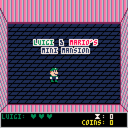

# The Bros' Mini Mansion

This is a tiny game I am making to teach my nephew about game programming. You will need pico8 to run these files. 

## How to play and edit online:

If you just want to play, I keep updated web builds here: https://www.lexaloffle.com/bbs/?tid=47952

If you also want to be able to edit the game through your web browser, you can do the following:

1. Navigate to the pico-8 education edition. This link will automatically load this game: https://www.pico-8-edu.com/?c=bG9hZCAjdGhlX2Jyb3NfbWluaV9tYW5zaW9uLTM=&g=w-w-w-w1HQHw-w2Xw-w3Xw-w2HQH

    

    *You should see this when you click the link*

2. You can play the game normally - it should accept keyboard (press X to use your vacuum, arrows to move) or gamepad inputs. If you want to edit the game, press ESC. This will stop the game, and you will see a blinking cursor.

    

    *Game stops when you press escape*

3. If you press ESC again, you will go into edit mode. If you look in the upper-right, you will see 5 icons - they stand for:
    1. Code
    2. Sprite (this is for drawing characters or bad guys or powerups)
    3. Map (this is for editing the map)
    4. Sound Effects
    5. Music

    

    *Game stops when you press escape*

4. If you just want to do some drawing, I recommend going to the sprite editor. This works like any paint program - just click a cell on the bottom of the screen to draw in, and then use the various tools to paint.

    

    *This works like paint*

5. The map editor lets you draw out the level. This is a little trickier - you may need to use the mouse wheel to zoom out, and you will need the "hand" tool to drag the view downwards so you can see the level. Then, you just use the little pictures like stamps and draw a level.

    

    *Mapping is trickier*

6. If you actually want to sav your work, press ESC to go back to the game screen, then type "SAVE *some_name*". This will download a file for you. You can load this into the editor later, or you can share it with me and I can incorporate it into the game later.

    

    *Saving*

## To do:
- ~~make stomping bad guy (sprite 60)~~
- add playable characters
- change characters at game start
    - function that pauses game and lets you switch
- make sprites stop dissappearing in walls
- add effects and sfx when spraying walls
- add pre-routine to make hidden wall sprites match normal sprites
- biggie health from 500 to 400
- sfx when coins bounce
- extra graphics on bookcases, 
- more kinds of furniture
- king boo cannot leave fight rooms
- maze graphics (maybe stairs for floor texture?)

## nice to have
- run button
- 

### cheatsheet

pico8 -displays_x 1 -displays_y 2